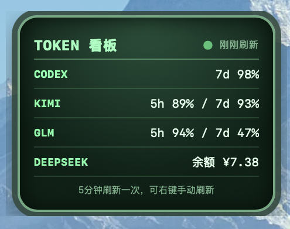

# Token 看板



仅支持 macOS 的桌面悬浮 Token/额度看板。它以无标题栏、透明背景的窗口常驻桌面，不占用菜单栏；可直接拖动到任意位置，并始终置顶显示。

## 功能

- 展示 CODEX、KIMI、GLM、DEEPSEEK 的可用额度或余额
- 自动读取本机已登录或已配置的账号；不会将凭据写入项目或上传到 GitHub
- 在供应商名称后显示当前订阅套餐，例如 Codex Plus、Kimi Allegretto 和 GLM max
- 每 5 分钟自动刷新，右上角展示距上次刷新的时间（刚刚刷新 / N 分钟前更新），底部标注可右键手动刷新
- CODEX 的 7d 额度回到 100% 时弹出系统对话框提醒（每次回到 100% 只提醒一次，低于 100% 后再次回到 100% 会重新提醒）
- 透明、无 Dock 图标的桌面悬浮窗口，可跨桌面显示并直接拖动
- 拖到左侧或右侧屏幕边缘时自动收起，仅保留贴边箭头标签；标签只可上下移动，点击恢复看板
- 右键菜单提供“刷新 / 设置 / 关闭”
- 可在设置中开启自动隐藏并调整展示秒数（默认 10 秒），也可以关闭订阅套餐标签；关闭套餐标签时看板恢复紧凑宽度，每次点击边缘箭头展开时都会重新计时

CODEX 行由本机已登录的 ChatGPT/Codex 获取。当前账号若只返回一个额度周期，就只显示该周期；若同时返回多个周期，看板会自动展示，例如 `5h 80% / 7d 60%`。

自动隐藏设置保存在 macOS 应用配置目录中。关闭自动隐藏时，看板会保持展开；启用后，看板会在设定时间结束时收起到距离当前窗口最近的屏幕边缘。

## 获取与配置凭据

不要把任何 Key、Token 或 `auth.json` 提交到 Git。本项目只读取你本机已有的登录和配置。

### CODEX

CODEX 额度不是手动粘贴 OpenAI API Key 获取的，而是来自 ChatGPT/Codex 登录账号的本机会话。

1. 安装并登录 ChatGPT 桌面版，或在终端执行 `codex login` 完成登录。
2. 登录信息由 Codex 保存在 `~/.codex/auth.json`；它等同于密码，请勿手动编辑、分享或提交。
3. Token 看板通过本机 Codex app-server 读取额度。OpenAI Platform API Key 与 ChatGPT/Codex 订阅额度是两套不同的计费体系，不能互换。

### KIMI

1. 安装 Kimi Code CLI 后执行 `kimi login`，按设备授权流程完成登录。
2. 登录成功后，新版 Kimi Code 会在 `~/.kimi-code/credentials/kimi-code.json` 保存访问凭据；旧版 Kimi CLI 的凭据位于 `~/.kimi/credentials/kimi-code.json`。
3. 看板优先读取新版 `~/.kimi-code` 凭据，读取或认证失败时再回退到旧版 `~/.kimi`；两处都无法获取有效登录信息时显示“未登录”。
4. access_token 有效期只有约 15 分钟，看板会在过期时自动用 refresh_token 换新并写回当前使用的凭据文件；不要复制、编辑或上传此文件。

### GLM（智谱）

1. 在 [智谱开放平台的 API Key 页面](https://open.bigmodel.cn/usercenter/proj-mgmt/apikeys) 创建 API Key。
2. 在 cc-switch 的 **Codex** 供应商配置中新增或编辑名称为 `Zhipu GLM` 的供应商，并填入 Key。
3. cc-switch 将配置保存在 `~/.cc-switch/cc-switch.db` 的 `providers` 表中；本项目读取 `settings_config.auth.OPENAI_API_KEY`。请通过 cc-switch 修改，不要直接编辑 SQLite 数据库。

### DeepSeek

1. 在 [DeepSeek Platform API Keys](https://platform.deepseek.com/api_keys) 创建 API Key。
2. 在 cc-switch 的 **Codex** 供应商配置中新增或编辑名称为 `DeepSeek` 的供应商，并填入 Key。
3. 位置同样是 `~/.cc-switch/cc-switch.db` 的 `providers` 表及 `settings_config.auth.OPENAI_API_KEY` 字段；请通过 cc-switch 管理。

未配置、未登录或凭据失效的服务会在看板中明确显示状态，不会回显密钥。

## 从源码运行

```bash
npm install
npm run tauri dev
```

## 打包

```bash
npm run tauri build
```

构建结果位于：

```text
src-tauri/target/release/bundle/macos/Token 看板.app
```

应用未签名或公证。首次打开被 macOS 阻止时，可在“系统设置 → 隐私与安全性”中选择允许打开。

## 发布新版本

发布已全自动（`.githooks/pre-push` + `.github/workflows/release.yml`）：

1. 提交代码改动，push 到 `main` 即可，无需手动改版本号。
2. pre-push 钩子会检查 `package.json` 当前版本是否已发布：已发布则自动把 patch 版本 +1，生成一个 `chore: bump version` 提交随本次 push 一起推送；尚未发布（比如手动改过版本号）则保持不变。想跳过自动提升可用 `git push --no-verify`。
3. CI 检测到新版本号后自动完成 macOS 构建、ad-hoc 签名、压缩，并创建 tag 与 Release（`TokenBoard-v<版本>-macos.zip`，标记为 Latest）；版本号没变则自动跳过。

钩子随仓库提交在 `.githooks/` 中。首次克隆后执行一次 `npm install`（`prepare` 脚本会自动配置 `core.hooksPath`），或手动执行 `git config core.hooksPath .githooks`。

## 说明

Codex 额度读取依赖本机 Codex 的 app-server 接口；该接口当前仍属于 experimental，未来 Codex 更新若改变接口，看板会显示“读取失败”，其余服务不受影响。
